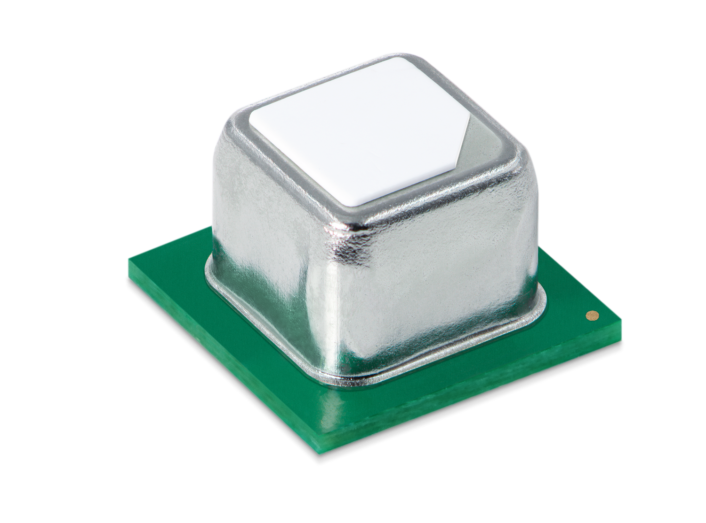

# Sensirion Embedded I2C SCD4x Driver

This is a generic embedded driver for the [Sensirion SCD4x Carbon Dioxide Sensor](https://www.sensirion.com/environmental-sensors/carbon-dioxide-sensors/carbon-dioxide-sensor-scd40/).
It enables developers to communicate with the SCD4x sensor on different hardware platforms by only adapting the I2C communication related source files.

[<center></center>](https://sensirion.com/my-scd-ek)

# Getting started

## Implement the I2C Interface

So we need to adjust two files according to your platform.

### Edit `sensirion_i2c_hal.c`

This file contains the implementation of the sensor communication
(how to send requests to the sensor). Therefore, how this is done depends on your
hardware platform. Therefore we can only provide function stubs in which you
can implement the logic yourself. 
There are sample implementations available for some platforms: [`sample-implementations`](sample-implementations).
If you are using a Linux based platform like Raspberry Pi
you can just replace the unimplemented HAL template with the provided
implementation in `sample-implementations/linux_user_space/`:

```
cp sample-implementations/linux_user_space/sensirion_i2c_hal.c ./
```

### Edit `sensirion_config.h`

If you are on a Linux based platform you can skip this part since
everything is already correctly setup for you.

Otherwise you need to check if the libraries `<stdint.h>` and
`<stdlib.h>` are provided by your toolchain, compiler or system.
If you have no idea on how to do that you can skip this
step for now and come back when you get errors related to these names when 
compiling the driver.
The features we use out of those libraries are standard integer sizes
from `<stdint.h>` and `NULL` from `<stdlib.h>`. If they are not available
you need to specify the following integer types yourself:

* `int64_t` = signed 64bit integer
* `uint64_t` = unsigned 64bit integer
* `int32_t` = signed 32bit integer
* `uint32_t` = unsigned 32bit integer
* `int16_t` = signed 16bit integer
* `uint16_t` = unsigned 16bit integer
* `int8_t` = signed 8bit integer
* `uint8_t` = unsigned 8bit integer

In addition to that you will need to specify `NULL`.
For both we have a detailed template where you just need to fill in
your system specific values.

Now we are ready to compile and run the example usage for your sensor.

## Compile and Run

Take the `.c` and `.h` files directly in this folder pass them to your 
favorite C compiler and run the resulting binary.
This step may vary, depending on your platform. Here we demonstrate the 
procedure for Linux based platforms:

1. Open up a terminal.
2. Navigate to the directory where this README is located.
3. Run `make` (this compiles all the code here to one binary).
4. Run `./scd4x_i2c_example_usage` (This will run your newly compiled binary).
5. Now you should see the first measurement values appear in your terminal.
   As a next step you can adjust the example usage file or write your own
   main function to use the sensor.

# Background

## Files

### sensirion\_i2c.[ch]

In these files you can find the implementation of the I2C protocol used by Sensirion
sensors. The functions in these files are used by the embedded driver to build the
correct frame out of data to be sent to the sensor or receive a frame of data from
the sensor and convert it back to data readable by your machine. The functions in
here calculate and check CRCs, reorder bytes for different byte orders and build the
correct formatted frame for your sensor.

### sensirion\_i2c\_hal.[ch]

In these files you can find the implementation of the hardware abstraction layer used
by Sensirion's I2C embedded drivers. This part of the code is specific to the underlying
hardware platform. This is an unimplemented template for the user to implement.
In the `sample-implementations/` folder we provide implementations for the most common
platforms.

### sensirion\_config.h

In this file we keep all the included libraries for our drivers and global defines.
Next to `sensirion_i2c_hal.c` *it's the only file you should need to edit to get your
driver working.*

### sensirion\_common.[ch]

In these files you can find some helper functions used by Sensirion's embedded drivers.
It mostly contains byte order conversions for different variable types. These functions
are also used by the UART embedded drivers therefore they are kept in their own file.
